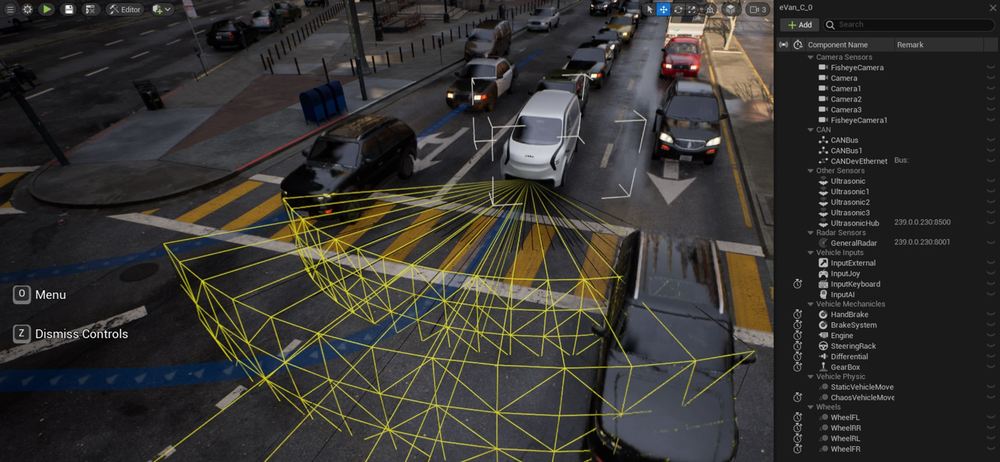

# SODA.Sim  

[SODA.Sim](https://soda.auto/products/sim/index.html) is designed for seamless software validation of any vehicle, covering the entire process from initial concept through certification to aftermarket updates.

By simulating vehicles at the level of atomic components, such as sensors, vehicle systems, and electronic control units SODA.Sim is not only a perfect tool for AD/ADAS development, but also a virtual proving ground for validation and certification of all vehicle functions.

SODA.Sim is empowered by SODA Validation Library. You can choose available tests or craft your bespoke scenarios in real-time. Be the first to access SODA Validation Library with a built-in AI scenario generator and AI scenario mixer.**SodaSim** is a plugin for UnrealEngine that turns UnrealEngine into a vehicle simulator tool.  

Full list of features see [here](https://docs.soda.auto/projects/soda-sim/en/latest/Introduction.html).  

## Docs
All documentation is [here](https://docs.soda.auto/projects/soda-sim) 
Quick start [here](https://docs.soda.auto/projects/soda-sim/en/latest/How_To/Quick_Start.html)  

## Install

This repository is plugin for UnrealEngine. You can clone this repo to the UnrealEngine's plugins folder or to the project plugins folders. Then you need to follow the next steps: [Setup a New UProject](https://docs.soda.auto/projects/soda-sim/en/latest/How_To/Setup_a_New_UProject.html)

> Keep it mind this repo contain one submodule **SodaSimProto**. Keep it mind you clone the submodule as well.

See more information about [Working with Plugins in Unreal Engine](https://docs.unrealengine.com/5.0/en-US/working-with-plugins-in-unreal-engine/).

## Supported OS
* Windows
* Linux (not tested)

## Roadmap

* Integration with [Project Chrono](https://projectchrono.org/) for accurate vehicle physics simulation.
* Analog/Digital Input/Output hardware interface. 
We have almost finished developing our own hardware, which will allow virtual Analog/Digital Input/Output to be mapped to real hardware for HIL purpose.
* Realtime Python Scripts. Support [Unreal Editor Python](https://docs.unrealengine.com/5.2/en-US/scripting-the-unreal-editor-using-python/) to work in game mode.
* Simulink Model Importing. Ability to develop vehicle components using Simulinks and import them into the simulator.
* LIN interfce support.
* City Traffic Generation based on the Summo.
* Support of the OpenScenario.
* Distributed simulation. Horisontal parallelization of simulation on multiple computers to simulate more vehicle sensors.
* Integration with ROS/ROS2.

## Contact
Please feel free to provide feedback or ask questions by creating a Github issue. For inquiries about collaboration, please email us at sim@soda.com.

## Copyright and License
Copyright © 2023 SODA.AUTO UK LTD. ALL RIGHTS RESERVED.  
This software contains code licensed as described in [LICENSE](LICENSE.md).  

### Third Parties Licenses
Please ensure to comply with the respective licenses when using these third-party components in your project.
Lists the licenses for third-party software used in this project:
* **dbcppp** - Licensed under the MIT License(https://opensource.org/licenses/MIT).
* **libzmq** - Licensed under the Mozilla Public License 2.0(https://www.mozilla.org/en-US/MPL/2.0/).
* mongodb Licensed under the Server Side Public License (SSPL) v1.0(https://www.mongodb.com/licensing/server-side-public-license). MongoDB drivers are available under the Apache License v2.0 (https://www.apache.org/licenses/LICENSE-2.0).
* **mongodb-cxx** - Licensed under the Apache License, version 2.0 (https://www.apache.org/licenses/LICENSE-2.0).
* **opendrive_reader** - Licensed under the MIT License (https://opensource.org/licenses/MIT).
* **pugixml** - Distributed under the MIT License (https://opensource.org/licenses/MIT).
* **quickhull** - Licensed under the BSD-2-Clause license (https://opensource.org/licenses/BSD-2-Clause).
* **3D models** - Licensed under the CC-BY License (https://creativecommons.org/licenses/by/4.0/).
* **Unreal Engine** - Dependencies Associated with the Unreal Engine EULA (https://www.unrealengine.com/en-US/eula).

